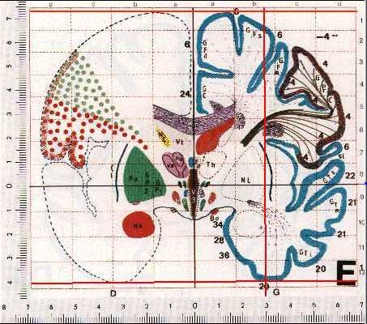
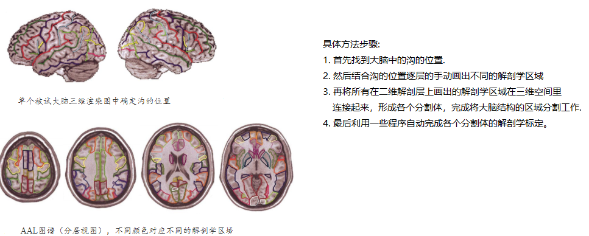
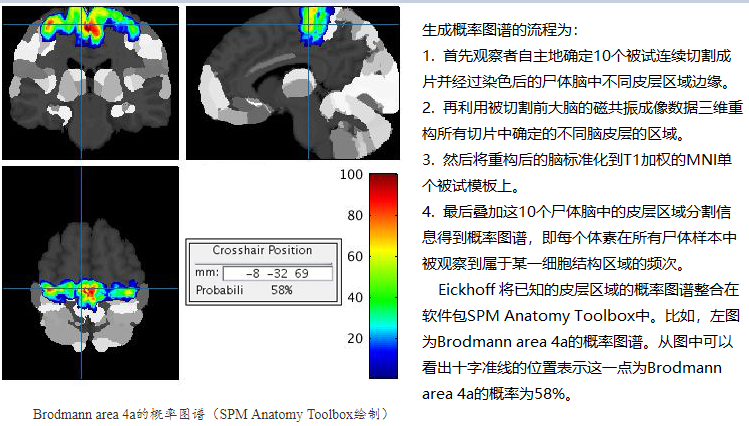

<!-- @import "[TOC]" {cmd="toc" depthFrom=1 depthTo=6 orderedList=false} -->

<!-- code_chunk_output -->

- [Q1. Talairach空间、MNI空间、Native空间、Stereotaxic空间、自动解剖标记（AAL）图谱、概率图谱区别](#q1-talairach空间-mni空间-native空间-stereotaxic空间-自动解剖标记aal图谱-概率图谱区别)
  - [Native空间](#native空间)
  - [MNI(Montreal Neurological Institute)空间](#mnimontreal-neurological-institute空间)
  - [Talairach空间](#talairach空间)
  - [Stereotaxic空间](#stereotaxic空间)
  - [自动解剖标记（AAL）图谱](#自动解剖标记aal图谱)
  - [概率图谱](#概率图谱)

<!-- /code_chunk_output -->

### Q1. Talairach空间、MNI空间、Native空间、Stereotaxic空间、自动解剖标记（AAL）图谱、概率图谱区别

#### Native空间
> 原始空间:图像没有做任何变换时就是在原始空间。在这个空间中图像的维度、原点、voxel size等都是不同的，不同被试的图像之间不具有可比性，计算出来的任何特征都不能进行统计分析，或是用于机器学习。

#### MNI(Montreal Neurological Institute)空间
> MNI空间是基于大量的正常被试的MRI扫描得到的新的标准脑,一般而言MNI模板是最常用的，研究的比较多。

#### Talairach空间
> Talairach脑是从著名的Talairach和Tournoux图谱解剖并且拍摄得到的,这个图谱有与Brodmann分区近似的标记，图谱是作者看着Brodmann的图谱然后估计这些分区都在这些脑的哪些位置。Talairach空间可以判别当前坐标在什么解剖结构上.比如，输入Talairach坐标-40、-25、-54会得到响应结果Left Cerebrum, Parietal Lobe,Post Central Gyrus, Gray matter, Brodmann area 3。 

> **不推荐使用这个图谱，主要给出四点原因：
> * 该图谱只基于一名60岁妇女的大脑结构，缺乏群体代表性；
> * 现阶段主流的处理软件在进行空间标准化时大多使用MNI305作为配准模板。如果使用Talairach图谱，就另外需要将标准化后在MNI空间数据转化到Talairach空间，这将引进额外的误差。
> * 该图谱只基于左大脑半球结构并映射到另一大脑半球，没有考虑大脑半球的不对称性。
> * 该图谱的Broadmann区域划分不准确。

#### Stereotaxic空间
> Talairach atlas（图谱） and Talairach coordinates（坐标） 就是Stereotaxic space.

#### 自动解剖标记（AAL）图谱
> AAL图谱是由法国神经学家开发的数字化的大脑结构图谱，一般用于功能性神经影像研究中定位大脑的活动区域.该图谱是基于MNI单个被试的T1加权结构影像模板（已经标准化）绘制的。

#### 概率图谱
> 相比于前面描述的基于单个个体大脑，概率图谱尝试给出大量个体大脑结构的概率性描述：大脑某一位置上，分别属于多个不同细胞结构的可能性。

